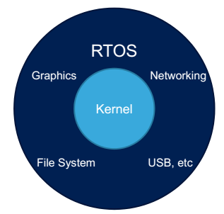

# Hệ thống RTOS là gì?
_______________________________
Một hệ thống thời gian thực (RTOS - Real Time Operating System) được thiết kế cho các nhiệm vụ đặc biêt:
  * Các ứng dụng cần được thực thi với thời gian thật chính xác, các lỗi phát sinh cần được cô lập và xử lý nhanh chóng.
  * Phải đáp lại các ngõ vào hay các sự kiện với thời gian giới hạn.
  * Một đáp ứng trễ là một đáp ứng sai.

#### Quy luật của hệ thống RTOS:
* Thời gian yêu cầu cho việc hoàn thành bất kỳ các function nào phải có hạn và có thể biết trước.
* Thời gian phản hồi tối đa phải tính toán được và được đảm bảo.
* Số chu kỳ yêu cầu để thực thi một toán tử đã cho phải luôn như nhau.
* Việc thực thi có bị ngắt nhưng độ trễ ngắt và thời gian xử lý phải được ngăn chặn.

### Những đối tượng không cần RTOS:
* Các ứng dụng với một mục đích.
* Các ứng dụng vòng lặp đơn giản và polling.
* Các ứng dụng tiêu biểu nhỏ hơn 32kBytes.

Chúng ta không cần RTOS để viết phần mềm nhúng hiệu quả nhưng ứng dụng dần dần tăng kích thước và độ phức tạp thì RTOS sẽ rất hữu ích. RTOS cho phép các ứng dụng phức tạp chia thành một tập nhỏ hơn và hơn nữa có thể quản lý các tác vụ. 

#### Tại sao nên sử dụng RTOS
* Đơn giản hóa việc chia sẻ nguồn tài nguyên: cung cấp cơ chế tập trung cho việc phân xử các yêu cho các nguồn tài nguyên như bộ nhớ và MCU ngoại vi.
* Phát triển và debug dễ dàng hơn
  * Các thành viên trong nhóm có thể làm việc độc lập.
  * Lập trình viên có thể tránh việc giải quyết chi tiết ngắt, timer và phần cứng.
  * Ứng dụng có thể bảo trì dễ dàng hơn.

## FreeRTOS
FreeRTOS là hệ thống thời gian thực miễn phí và mã nguồn mở được phát triển bởi Real Time Engineers Ltd. Mục đích của nó được phát triển để phù hợp với các hệ thống nhúng nhỏ và 
