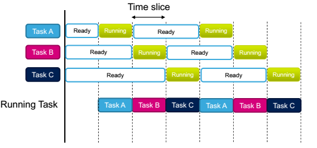
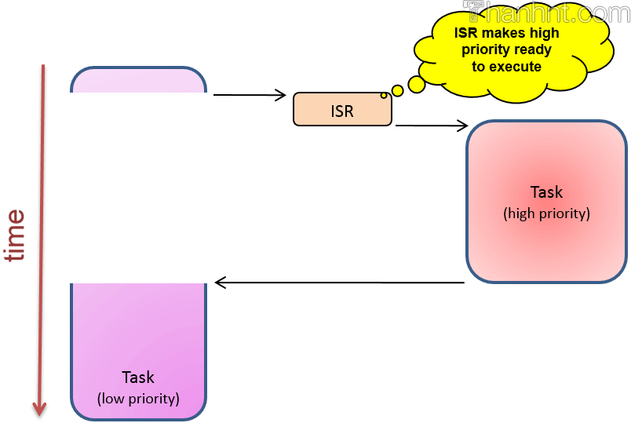
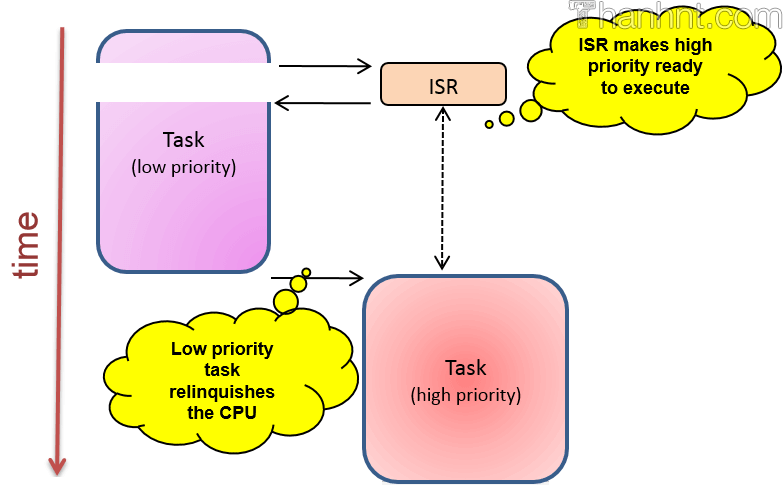

# Chức năng cơ bản của một RTOS

1. Bộ lập lịch (Scheduler)
2. Các dịch vụ thời gian thực (Realtime Services)
3. Đồng bộ và xử lý thông điệp (Synchronization và Messaging)

## Scheduler
Mỗi tác vụ có thể có 1 trong ba trạng thái chính:

* **Ready to rung:** là trạng thái mà tác vụ đã đủ các tài nguyên để khởi chạy nhưng chưa chạy. Đây là trạng thái chuẩn bị của tác vụ.
* **Running:** là trạng thái mà tác vụ đang được thực thi.
* **Blocked:** khi tác vụ không có đủ các tài nguyên cần thiết để chạy thì nó sẽ được đưa về trạng thái này.

Để lập lịch cho tác vụ, có 3 kỹ thuật được áp dung:

* **Co-operative scheduling** 
  * Giống như code thông thường.
  * Các task chỉ có thể được thực thi nếu task đang chạy "give up"/yield.
* **Round Robin Scheduling:** mỗi task được chia một khe thời gian cố định, nếu trong khoảng thời gian được chia đó mà task chưa thực hiện xong thì sẽ bị tạm dừng, chờ đến lượt tiếp theo để thực hiện tiếp công việc sau khi hệ thống xử lý hết một lượt các task.

* **Preemptive Scheduling:** phương pháp này ưu tiên phân bổ thời gian cho các task có mức ưu tiên cao hơn. Mỗi task được gán một mức ưu tiên duy nhất và có thể có nhiều task có cùng mức ưu tiên.
  * **Preemptive:** các task có mức ưu tiên cao nhất luôn được kiểm soát bởi CPU, khi phát sinh ISR thì hệ thống sẽ tạm dừng task đang thực thi, hoàn thành ISR sau đó hệ thống thực thi task có mức ưu tiên cao nhất tại thời điểm đó. Sau đó hệ thống mới tiến hành nối lại các task đang bị gián đoạn.Ở chế độ **preemptive**, hệ thống có thể đáp ứng các công việc khẩn cấp một cách nhanh chóng. Đa số các hệ thống thực tế đang chạy ở chế độ này.
  
  * **Non-preemptive:** ở chế độ non-preemptive thì các task được chạy cho đến khi nó hoàn tất. Khi phát sinh ISR thì hệ thống sẽ tạm dừng task đang thực thi và hoàn thanh ISR, sau khi hoàn thành ISR thì hệ thống sẽ quay lại thực thi nốt phần việc còn lại của task bị gián đoạn. Task có mức ưu tiên cao hơn sẽ giành quyền kiểm soát CPU sau khi task gián đoạn thực thi xong.
    * Ưu điểm của non-preemptive: độ trễ gián đoạn thấp.
    * Nhược điểm: do phải chờ task thực thi xong thì task có mức ưu tiên cao mới được thực thi, do đó mức đạp ứng của hệ thống thấp. Vì vậy rất ít hệ thống sử dụng non-preemptive.

  

