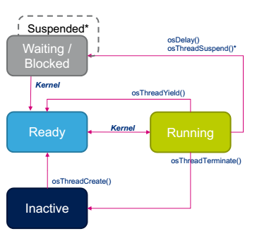
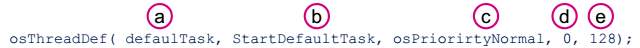

# Một tác vụ trong FreeRTOS
FreeRTOS không giới hạn số lượng các tác vụ có thể chạy miễn sao phần cứng và bộ nhớ có thể điều khiển được. FreeRTOS cho phép điều khiển cả các tác vụ có chu kỳ và không có chu kỳ.

## Vòng đời của một tác vụ
Phần này sẽ mô tả chính xác hơn nữa về cách có thể gọi ra một tác vụ từ lúc nó được tạo ra cho tới khi nó bị hủy. Ở đây, chúng ta sẽ xem chỉ có sẵn duy nhất một nhân vi xử lý, nghĩa là chỉ một sự tính toán hay chỉ một tác vụ có thể chạy tại thời điểm đã cho. Bất kỳ tác vụ đã cho có một trong hai trạng thái: "running" và "not running". Như chúng ta đã giả định rằng chỉ có một lõi, một tác vụ có thể chạy tại một thời điểm đã cho; mọi tác vụ khác trong trạng thái "not running". 

Khi một tác vụ chuyển trạng thái từ "not running" sang "running", ta gọi đó là "swapped in" hay "switched in", ngược lại là "swapped out" hay "switched out".

*CMSIS RTOS đưa ra task như Thread, trong bài này task được dùng thay thế nghĩa cho thread*

Một task có thể có một trong những trạng thái:
* **Running:** task hiện tại đang thực thi. Chỉ có **một** task có thể ở trạng thái này tại một thời điểm bất kỳ.
* **READY:** task này đủ để thực thi nhưng không chạy do một task khác có độ ưu tiên ngang bằng hay cao hơn đang được thực thi.
* **WAITING:** các task đang chờ một sự kiện xảy ra
  * Điển hình là sau khi gọi osSemaphoreWait(), osMutexWAit()...
* **INACTIVE (BLOCKED):** các task này không được tạo hoặc bị giới hạn trong trạng thái này. 

Nhân kernel sẽ điều khiển việc chuyển các task. Nó lưu nội dung của task khi nó bị suspend (treo lơ lửng) và khôi phục lại khi task được resume. Kernel thực thi và hoàn thành việc chuyển task:
* Sau một thời gian thực thi được định trước. 
* Khi một sự kiện (event) mở ra một task có mức ưu tiên cai hơn xảy ra. (signal, queue, semaphore...)
* Khi một task gọi osThreadYield() để báo cho kernel để chuyển task khác mà không phải chờ tới lúc kết thúc thời gian silce.

Kernel được bắt đầu khi sử dụng API osKernelStart(). Khi bắt đầu kernel sẽ tự động tạo một task mặc định được gọi là Idle Task.

## Cách tạo một Task
*Các hàm sử dụng trong bài này là HAL API được tạo từ phần mêm CubeMX của ST*
1. Định nghĩa task 

  a. Tên của task 
  b. Tên hàm vào của task
  c. Khởi tạo mức ưu tiên của task 
  d. Số task sẵn có
  e. Kích thước ngăn xếp (byte) yêu cầu bởi hàm task 
2. Tạo task và cấp phát bộ nhớ
  

