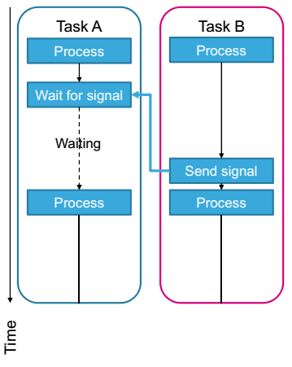
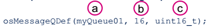
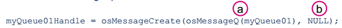
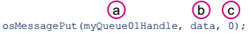
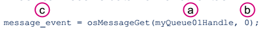
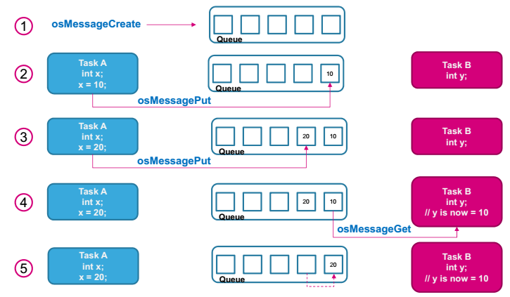
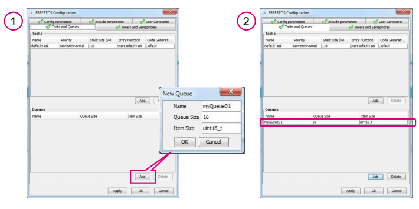

# Queue management
Queue la một kỹ thuật làm cơ sở cho mọi truyền thông các task và đồng bộ trong môi trường freeRTOS. Chúng là một chủ đề quan trọng không thể tránh được khi xây dựng những ứng dụng phức tạp với các task co-operating với task khác. Chúng được hiểu là để lưu trữ và độ dài dữ liệu có hạn (tên là "length"). 

## Signal Event
Các signal event được sử dụng để đồng bộ các task tức là buộc các task phải bắt đầu thực thi tại lúc định nghĩa event.

Ví dụ trong một một ứng dụng máy giặt, task A điều khiển mô-tơ và task B điều khiển cảm biến nước đổ vào.

* Task A sẽ cần chờ cho nước đổ đầy trước khi bắt đầu mô-tơ. Điều này có thể đạt được bằng cách sử dụng signal event.
* Task A sẽ chờ signal event từ task B trước khi bắt đầu mô-tơ.
* Task B sẽ gửi tín hiệu tới task A khi cảm biến nước phát hiện nước đã đạt đúng mức.

Một task:

* Có thể chờ một signal để set trước khi tiếp tục thực thi. Các task sẽ đi vào trạng thái WAITING cho tới khi tín hiệu được set.
* Set một một tín hiệu hoặc nhiều bởi nhiều task khác nhau cho trước.

Mỗi task được ấn định tối đa 32 signal event.

Ưu điểm: nhanh hơn và sử dụng ít RAM hơn so với semaphore hay message queue.

Giới hạn: chỉ có thể sử dụng khi chỉ một task đó nhận được signal.

## Message Queue
Chúng cho phép đọc và ghi bởi vài task khác nhau, và không theo một task một cách riêng biệt. Một queue thường là một FIFO nghĩa là các thành phần được đọc trong khi đã được ghi. Cách xử lý này phụ thuộc vào phương thức ghi: hai function ghi có thể được sử dung để ghi hoặc tại lúc bắt đầu hoặc lúc kết thúc queue đó.

### Việc đọc trong một queue
Khi một task đơn đọc trong một queue, nó được chuyển tới trạng thái "Blocked" và đưa trở lại "Ready" ngay khi dữ liệu được ghi vào trong queue bởi một task khác hoặc một ngắt. Nếu có một số task cố gắng đọc một queue, task nào có mức ưu tiên cao nhất đọc đầu tiên. Cuối cùng, nếu có vài task có độ ưu tiên như nhau cố gắng đọc task, task yêu cầu đầu tiên được chọn. Một task cũng có thể được chỉ định một thời gian chờ tối đa để queue cho phép nó được đọc. Sau thời gian đó, task tự động chuyển lại trạng thái "Ready"

### Việc ghi trong một queue
Việc ghi trong queue cũng tuân theo luật như việc đọc. Khi một task cố gắng ghi vào queue, nó phải chờ tới khi có được chỗ trống: task bị blocked cho tới khi task khác đọc queue và có khoảng trống.
### Cách tạo queue
Độ dài của queue và độ rộng của nó (kích thước của các element của nó) được cho trước khi queue được tạo ra.
* Bước 1: Định nghĩa queue

  a. Tên của queue
  b. Số item trong queue
  c. Kích thước của một item
  
* Bước 2: Tạo queue và phân cấp bộ nhớ

  a. Định nghĩa queue
  b. Task ID (không sử dụng) hoặc NULL
  
* Task có thể gửi dữ liệu tới một task khác (ghi vào queue)

  a. Handle/ID queue được sử dụng
  b. Dữ liệu để ghi
  c. Thời gian time-out (ms)
  
* Task có thể nhận dữ liệu từ một task khác (đọc từ queue)

  a. Handle/ID queue
  b. Thời gian time-out (ms)
  c. `osMessageGet()` sẽ trả về một structure/object osEvent. Dữ liệu được lưu trong `message_event.value`
  
  
Cả hai Task A và B đều có cùng một mức ưu tiên.
1. Một queue được tạo ra cho phép task A và B giao tiếp. Queue có thể giữ tối đa 5 giá trị. Khi một queue được tạo ra, nó không có bất kỳ giá trị nào.
2. Task A ghi một giá trị vào queue; giá trị được đưa ra sau.
3. Task A lại gửi 1 giá trị khác. Queue bây giờ gồm có giá trị đã ghi lần trước và giá trị mới thêm vào. Giá trị lần trước còn lại đứng trước trong queue trong khi giá trị mới đứng ngay sau đó. Vẫn còn 3 chỗ trống.
4. Task B đọc một quá trị trong queue. Nó sẽ nhận giá trị đứng đằng trước của queue.
5. Task B gỡ một item. Item thứ 2 được chuyển lên trước trong queue. 4 chỗ trống bây giờ sẵn có.

### STM32CubeMX - Queue

Các thành phần sau có thể sử đổi
* Name
* Size of queue
* Size of item in queue

