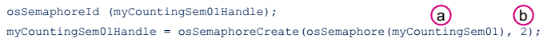

# Resources management
## Binary semaphores
Binary semaphores là cách đơn giản hiệu quả nhất để đồng bộ các task, một cách cũng đơn giản hơn nữa, nhưng không mang lại hiệu quả, phù hợp trong polling một input hay 1 resource. Một binary semaphore có thể xem như một queue mà nó chỉ gồm có 1 element.

## Counting semaphores
Một counting semaphore là một semaphore mà có thể lấy được một vài lần (nhưng có giới hạn) trước khi nó không có sẵn. Nó duy trì một giá trị được tăng lên là semaphore được cho trước, và giảm xuống khi khi bị lấy đi. Nó có thể so sánh được với một queue với ít element nào đó. Khi nó được tạo ra, một counting semaphore có thể được khởi tạo sẵn sàng số lần tùy ý.

* Đặc điểm:
  * Có nhiều token
  * Đồng bộ nhiều hành động
* Mặc định, counting semaphore bị chặn trong cấu hình STM32CubeMX freeRTOS
* Counting semaphore điển hình sử dụng để đếm các event hoặc quản lý resource.
* Đếm event
  * Một bộ điều khiển event sẽ "cho" một semaphore mỗi thời điểm mà event xảy ra (tăng giá trị đếm semaphore).
  * Một bộ điều khiển task "lấy" một semaphore mỗi thời điểm nó xử lý một event (giảm giá trị đếm semaphore).
  * Giá trị đếm là sự khác nhau giữa số event mà nó được xảy ra và số event mà nó đươc xử lý.
* Quản lý resource
  * Giá trị đếm cho biết số resource sẵn có.
  * Để đạt được điều khiển của resource một task đầu tiên phải đạt được  việc giảm giá trị đếm semaphore. Khi giá trị đếm về 0 thì không có resource nào rảnh.
  * Khi một task kết thúc với một resource nó "trả" semaphore lại bằng cách tăng giá trị đếm semaphore.

## STM32CubeMX - Semaphore
1. Định nghĩa semaphore
> osSemaphoreDef (myCountingSem01)

2. Tạo một semaphore

  a. Tên của semaphore
  b. Số token được tạo.
  
Task có thể giành được một semaphore
> osSemaphoreWait(myCountingSem01Handle, osWaitForever);

Task có thể phóng thích một semaphore
> osSemaphoreRelease(myCountingSem01Handle)

Cả 3 task A, B, C đều có cùng mức ưu tiên. Semaphore có 2 token.

1. Task C phát ra osSemaphoreWait() nhưng token semaphore đã bị lấy đi bởi task A và task B.
2. Trạng thhais của task C được set là Waiting và Task A được bắt đầu. Task B là "Ready".
3. Task B phát ra osSemaphoreRelease(). trạng thái task C được set là Ready. Khi mọi task đều có cùng mức ưu tiên, task B tiếp tục thực thi.
4. Task C cuối cùng cũng được thực thi.
 
 
## Mutexes
Mutexes được thiết kế để ngăn chặn việc loại trừ lẫn nhau hay việc đình trệ. Một mutex được sử dụng tương tự như một binary semaphore, trừ việc task lấy semaphore đó phải gửi lại. Điều nàu có thể thông qua với một token đã liên kết với resource để truy cập vào. Một task giữ token, làm việc với resource sau đó trả lại token. Trong lúc đó, không có một token nào khác được đưa cho mutex.

### Kế thừa mức ưu tiên
Kỹ thuật kế thừa mức ưu tiên

1. Task A (độ ưu tiên thấp) giành được mutex
2. Task B (độ ưu tiên cao) muốn giành được cùng semaphore đó.
3. Mức ưu tiên của task A tạm thời tăng lên để task B cho phép task A thực thi.
4. Task A phóng thích mutex và mức ưu tiên được khôi phục lại như trước cho phép task B tiếp tục thực thi.

  

